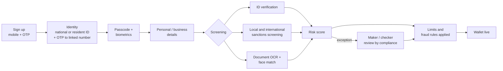

# Neo Pay: a digital wallet for a new city

**Product case study: how I scoped, sequenced and designed a consumer and merchant digital wallet, from capability map to quarterly roadmap to onboarding journeys, inside a regulated payments environment.**

> "Neo" is a renamed stand-in for the real client. Everything here is my own write-up and redrawn diagrams. No client documents, designs, data or results are reproduced.

[Roadmap](docs/roadmap.md) · [Capability map](docs/capability-map.md) · [Onboarding, KYC and risk](docs/onboarding-and-risk.md) · [Journeys](docs/journeys.md)

## Context

Neo is a greenfield city being built from scratch. It wanted its own payments layer: a mobile wallet that residents and visitors use for everyday spending, and that local merchants use to get paid, with the city's operations, compliance and support teams running it behind the scenes.

Three things made this harder than a typical wallet build:

- **Three products, not one.** A customer app, a merchant app and a back office for colleagues, each with its own outcomes.
- **Regulation from day one.** Digital KYC for individuals, KYB for businesses, sanctions screening, risk based limits and fraud rules all had to be in the first release, not bolted on later.
- **A city that doesn't exist yet.** Few merchants, unreliable connectivity on sites still under construction, and a population that changes every month.

## My role

Product manager on the delivery team, working with the client's product owners, design, engineering and compliance.

- Ran discovery and built the **capability map** of everything the platform needed
- Turned it into an **outcome based roadmap** across four quarterly planning increments
- Designed the **onboarding, KYC/KYB and risk model** with compliance
- Worked with design on the **customer and merchant journeys**, and wrote the backlog behind them

## The approach

### 1. Map the whole platform before choosing what to build

I started with a single capability map covering customer, merchant and colleague needs: onboarding, login, account and card management, funding, transfers, payments, transactions, notifications, security, support, reconciliation, settlement, reporting, analytics and marketing. Every capability was tagged to the release it would land in.

This gave everyone, from compliance to engineering, one picture of scope and made trade-offs visible. [See the capability map](docs/capability-map.md).

### 2. Roadmap by outcome, for every user, every quarter

Instead of a feature list, each planning increment states what **customers**, **merchants** and **colleagues** can do that they couldn't before. That kept the back office in step with the apps, which is where wallet launches usually slip: there is no point letting merchants accept payments if operations can't reconcile them.

| Increment | Theme | Example outcomes |
|---|---|---|
| PI 1 | **Get in and pay** | Sign up, biometric login, add cards and funds, pay merchants by QR, pay other users. Support can create merchant accounts |
| PI 2 | **Money in, money out, under control** | More ways to add funds, offline QR payments, withdraw to a local bank, request money, refunds. Ops set limits; compliance manages fraud rules and risk scoring |
| PI 3 | **Run the business** | Merchant cashier management and reports, embedded checkout for online merchants, split bills, direct debit. Reconciliation and settlement tooling |
| PI 4 | **Grow and serve** | Personalised offers, international payments, live chat, expense tracking, product analytics, support workflows |

[Full roadmap](docs/roadmap.md)

### 3. Design onboarding as a risk decision, not a form

Onboarding was where product, compliance and fraud met. The model I designed with compliance:

The key product decision: **the risk score sets the customer's limits** (daily, monthly, by merchant category), rather than blocking sign up until everything is verified. Users get into the app fast with low limits, and verification steps unlock more. [Details](docs/onboarding-and-risk.md)

### 4. Journeys that respect the user's time

- **Customer onboarding in four steps** with a visible progress bar: mobile, identity, passcode, personal details.
- **Progressive verification:** the home screen shows account verification progress and nudges biometric setup, instead of forcing everything up front.
- **Merchant onboarding as an application**, not a sign up: contact details, company information with registration documents, management and beneficial owner proof, business information, then review and submit. Progress can be saved and resumed, and the merchant can track application status.
- **A merchant home built around getting paid:** request a payment by amount, generate a QR code, see the balance, manage cards and bank settlement.

[Journey flows](docs/journeys.md)

## Product decisions worth calling out

| Decision | Why |
|---|---|
| Outcome based roadmap across three user groups | Kept back office readiness in lockstep with app features |
| Risk score drives limits, not a pass/fail gate | Faster activation without weakening controls |
| Offline QR payments early (PI 2) | Connectivity on a city under construction couldn't be assumed |
| Save and resume for merchant applications | KYB needs documents most owners don't have to hand |
| Maker / checker for every compliance exception | Auditability that regulators and the client's risk team required |
| Merchant cashier roles and static QR per cashier | Matches how real shops run tills and shifts |

## What I learned

- **Back office is the critical path.** Reconciliation, settlement and exception handling decide the launch date, not the app.
- **Compliance is a design partner.** Bringing them into journey design early turned "no" into "yes, with these limits".
- **Sequence by risk, not by excitement.** Split bills and offers are fun; limits, fraud rules and refunds are what make a wallet safe to scale.

## Skills shown

Discovery and capability mapping · outcome based roadmapping in quarterly planning increments · KYC/KYB and risk design · payments (QR, wallet, cards, settlement) · journey design with UX · backlog writing · stakeholder management across product, compliance and engineering
