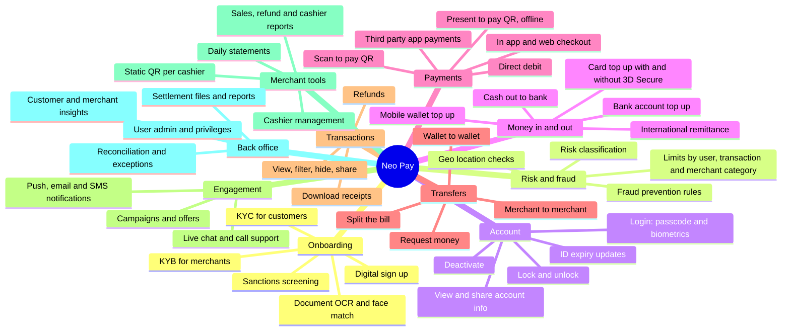

# Capability map

The full platform, grouped into domains. I used this to agree scope with every stakeholder before sequencing anything into the roadmap.

```mermaid
mindmap
  root((Neo Pay))
    Onboarding
      Digital sign up
      KYC for customers
      KYB for merchants
      Sanctions screening
      Document OCR and face match
    Risk and fraud
      Risk classification
      Limits by user, transaction and merchant category
      Fraud prevention rules
      Geo location checks
    Account
      Login: passcode and biometrics
      Lock and unlock
      View and share account info
      ID expiry updates
      Deactivate
    Money in and out
      Card top up with and without 3D Secure
      Mobile wallet top up
      Bank account top up
      Cash out to bank
      International remittance
    Payments
      Scan to pay QR
      Present to pay QR, offline
      In app and web checkout
      Direct debit
      Third party app payments
    Transfers
      Wallet to wallet
      Request money
      Split the bill
      Merchant to merchant
    Transactions
      View, filter, hide, share
      Download receipts
      Refunds
    Engagement
      Push, email and SMS notifications
      Campaigns and offers
      Live chat and call support
    Merchant tools
      Cashier management
      Static QR per cashier
      Sales, refund and cashier reports
      Daily statements
    Back office
      Reconciliation and exceptions
      Settlement files and reports
      Customer and merchant insights
      User admin and privileges
```
