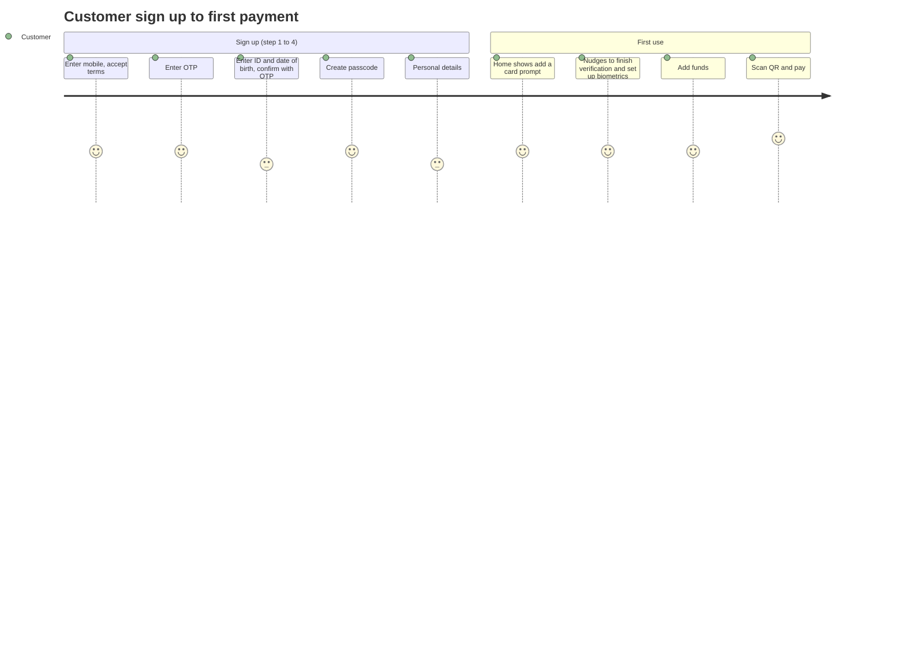

# Key journeys

Redrawn from the designs I worked on with the UX team. Screens are not reproduced.

## Customer: sign up to first payment

Design choices:
- A four step progress bar so users always know how far they are
- ID linked OTP proves the person owns the identity without a branch visit
- Verification and biometrics are prompted on the home screen as cards, not forced during sign up
- Offers and recent payees on the home screen once the wallet is funded

## Merchant: application to first payment

```mermaid
flowchart LR
  A[Start new application] --> B[Contact details<br/>mobile + email]
  B --> C[Company information<br/>+ registration document]
  C --> D[Management and<br/>beneficial owners]
  D --> E[Business category<br/>and expected volumes]
  E --> F[Review and confirm]
  F --> G[Application status<br/>tracked in app]
  G --> H[Approved: merchant ID<br/>+ passcode]
  H --> I[My store: balance,<br/>request payment, QR]
  I --> J[Get paid]
```

Design choices:
- An upfront checklist of what's needed before starting
- Save at any step; quitting asks whether to save progress
- Application status shows each section as complete, so merchants know what is holding them up
- The store home puts "request payment" first: enter an amount, generate a code
- Settings cover business profile, cards, bank account for settlement, notifications by channel, and Arabic language
