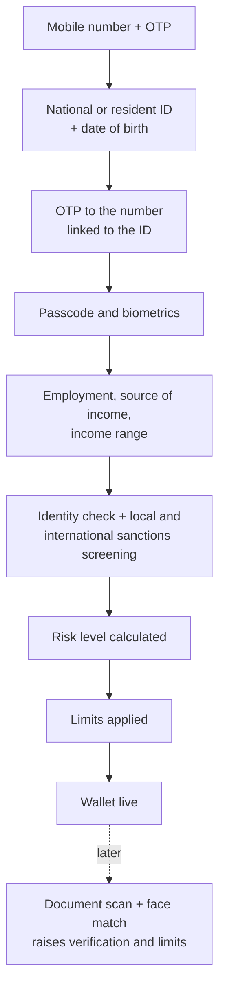
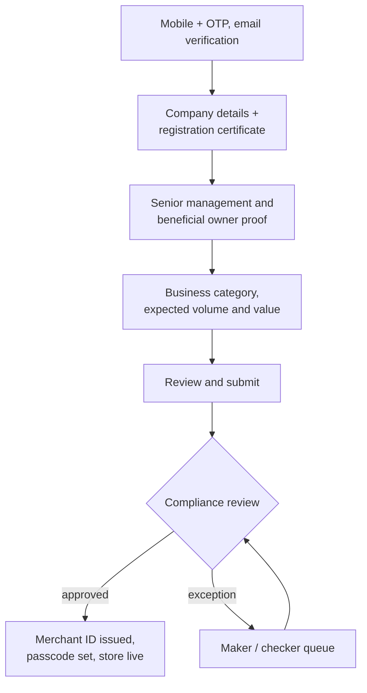

# Onboarding, KYC/KYB and risk

## Principles
1. **Fast in, gated by limits.** A new user reaches a working wallet quickly; how much they can do depends on their risk level and how far they have verified.
2. **One risk engine, many controls.** The same risk score drives transaction limits, fraud rules and when a case goes to a human.
3. **Every exception has an owner.** Anything automation can't decide goes to a maker / checker queue in the back office.

## Customers (KYC)

## Merchants (KYB)

Merchants can save and resume their application and track its status, because KYB documents are rarely to hand in one sitting.

## Controls driven by risk

| Control | Set by | Example |
|---|---|---|
| User limits | Risk level | Lower daily and monthly limits until verification is complete |
| Transaction limits | Operations | Per transaction caps by payment type |
| Merchant category limits | Compliance | Daily and monthly in and out limits by merchant category |
| Fraud rules | Compliance | Rule based cases, geo location checks |
| Account status | Operations | Lock when an ID expires, unlock when it is updated |
