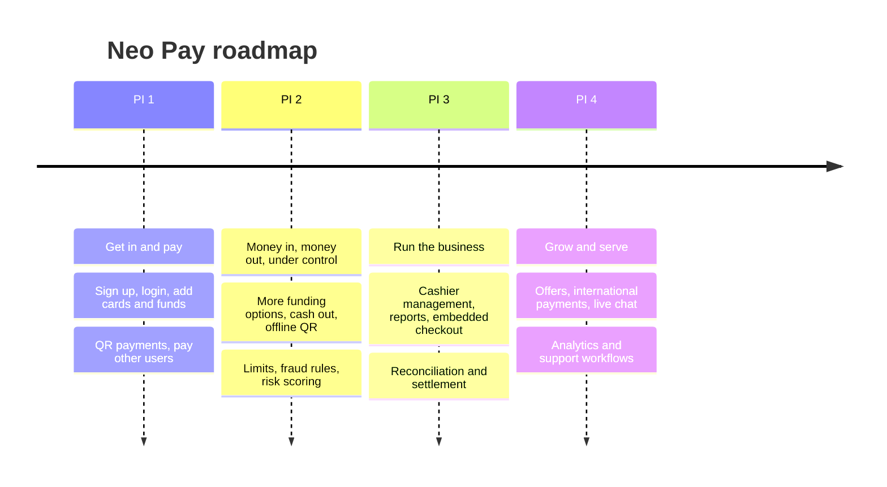

# Roadmap: outcomes by planning increment

Each increment states what each user group can do by the end of the quarter. Customer, merchant and colleague outcomes ship together, so no app feature goes live without the back office to support it.

## PI 1: Get in and pay

| Customers | Merchants | Colleagues |
|---|---|---|
| Sign up for an account and wallet | Sign up for a business account and wallet | Support can create merchant accounts |
| Log in and out with biometrics or passcode | Log in and out with biometrics or passcode | |
| Link debit and credit cards and add funds | Accept QR payments in physical stores | |
| Pay merchants by QR in store and through embedded checkout online | | |
| Pay other wallet users | | |

## PI 2: Money in, money out, under control

| Customers | Merchants | Colleagues |
|---|---|---|
| Add funds with a mobile wallet or local bank transfer | Control limits, lock and unlock the wallet | Operations set and update customer and merchant limits |
| Pay merchants offline with a customer presented QR | Add funds by mobile wallet or bank transfer | Compliance manage onboarding exceptions |
| Withdraw the balance to a local bank | Link a bank account to withdraw daily takings | Compliance define and manage fraud prevention rules |
| Request money from contacts and follow up | Refund a customer | Compliance configure the risk score engine and link risk levels to limits and rules |
| Download or hide transactions | Add, remove and manage cashiers, print a static QR per cashier | Support view customer and merchant details and transactions |
| | | Marketing push campaigns |

## PI 3: Run the business

| Customers | Merchants | Colleagues |
|---|---|---|
| Complete KYC by scanning documents with face verification | Embed the wallet in their own web and mobile checkout | Operations manage account status for compliance and risk |
| Set up direct debits | Transfer to other merchants | Admins create users and manage privileges |
| Split bills with contacts | Accept offline customer presented QR payments | Operations oversee reconciliation and resolve daily exceptions |
| View, download and get notified about transactions | Sales, cashier and refund reports for any period, daily statements | |

## PI 4: Grow and serve

| Customers | Merchants | Colleagues |
|---|---|---|
| Personalised offers | Call support from the app | Support log calls, manage complaints and take actions on behalf of users |
| International payments | | Workflow with assigned owners and actions |
| Live chat support | | Product analytics on usage |
| Expense tracking linked to transactions | | |
